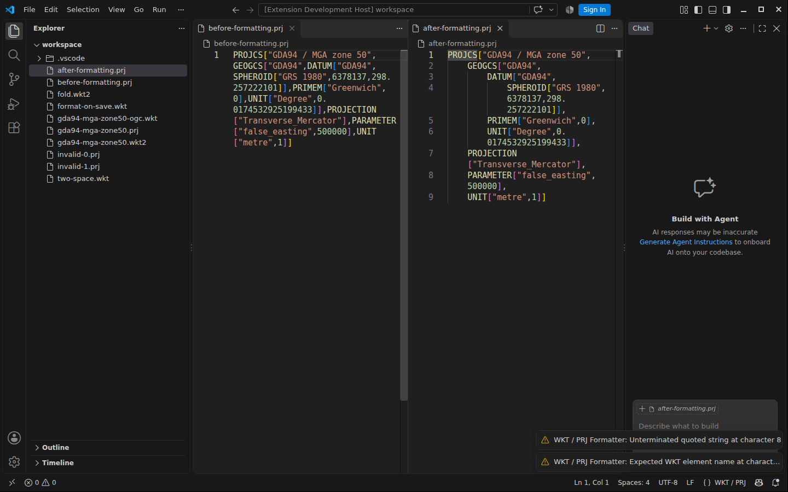

# WKT / PRJ Formatter

A lightweight VS Code formatter for **WKT1**, **WKT2** and **PROJ parameter strings** in GIS projection files (`.prj`, `.wkt`, `.wkt2`). Changes layout only; it does not change CRS parameters, convert formats or validate coordinate systems.



## Install

Download the latest `.vsix` from [GitHub Releases](https://github.com/Chain-Frost/WKT_PRJ-formatter/releases), then in VS Code choose **Extensions → … → Install from VSIX**. No Node.js or additional runtime tools are needed.

## Use

Open a supported file, then select **Format Document** (`Shift+Alt+F` on Windows/Linux) or **WKT / PRJ: Format WKT / PRJ** from the Command Palette.

To format automatically on save:

```json
{
  "[wkt]": {
    "editor.defaultFormatter": "Chain-Frost.wkt-prj-formatter",
    "editor.formatOnSave": true
  }
}
```

WKT uses a GDAL/pyproj-like hierarchical layout. PROJ strings place one complete parameter per line and indent pipeline steps. The extension preserves parameter values, their order, original quotes, delimiters, numeric precision and line-ending style. Invalid or unsupported definitions are not modified.

## Documentation

- [Formatting examples and editor features](docs/formatting.md)
- [Reference CRS fixtures (EPSG:28350)](fixtures/README.md)
- [Standards and parameter sources](docs/standards.md)
- [Development, CI and manual VSIX builds](docs/development.md)
- [Release process](docs/releases.md) · [Changelog](CHANGELOG.md)

MIT licensed.
